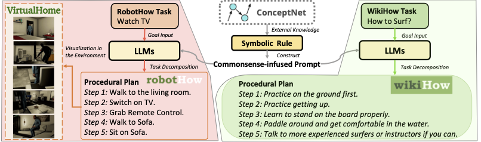

# PLANNER
Preprocess provide the utils to construct the data.

Evaluation provodie the code for automatic and human evaluation tools.

Planning contain the main code for our approach and reproduced planners for procedural planning.

Visualization provide the code we use to visualize in the environment.

The overview example is shown as below:

</img>